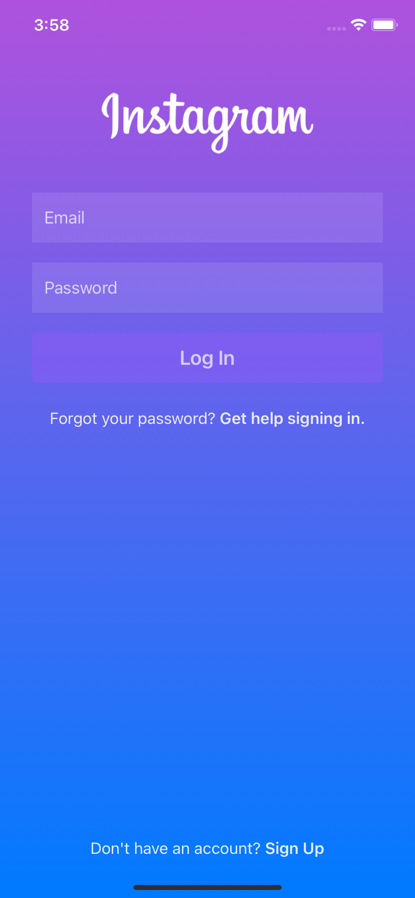
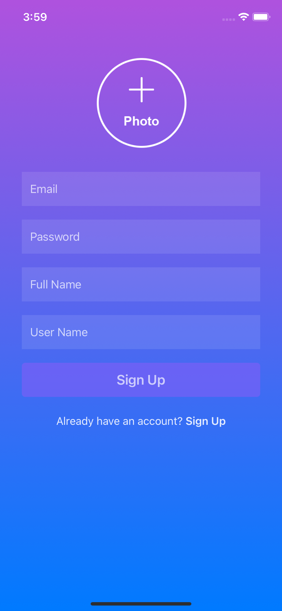
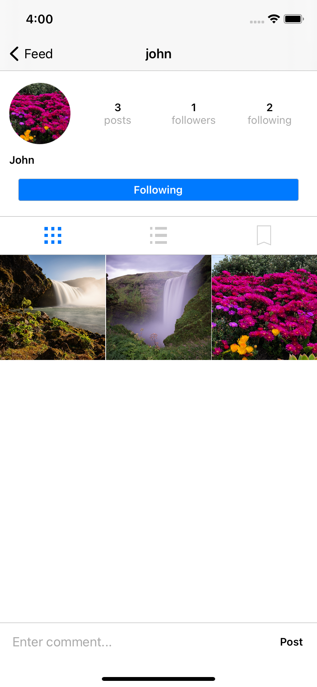
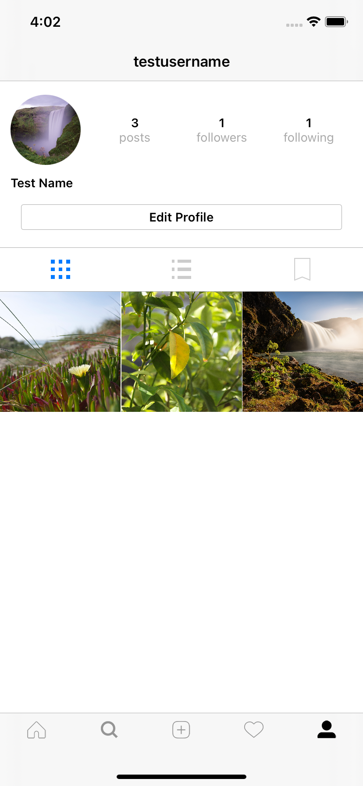
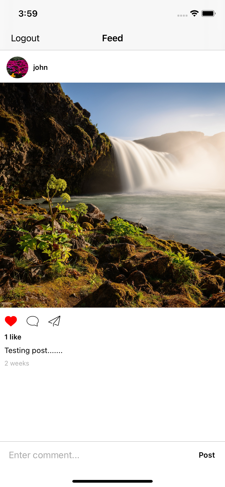
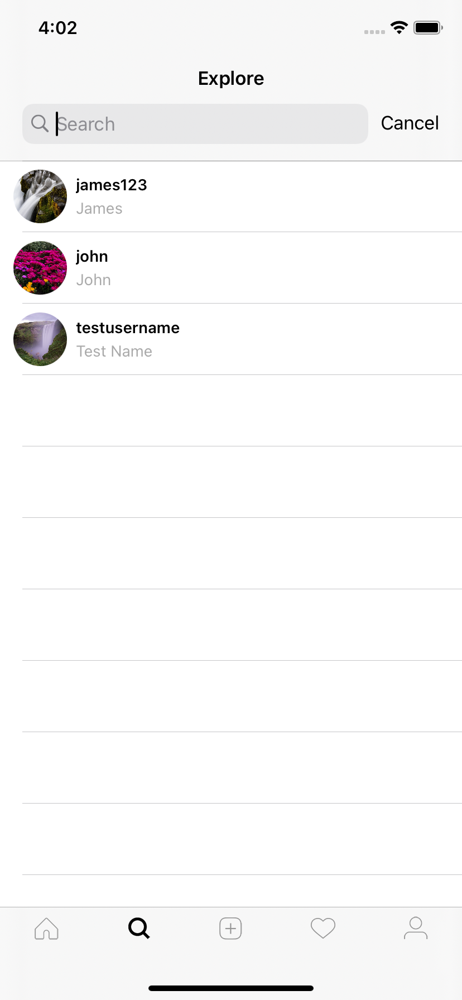
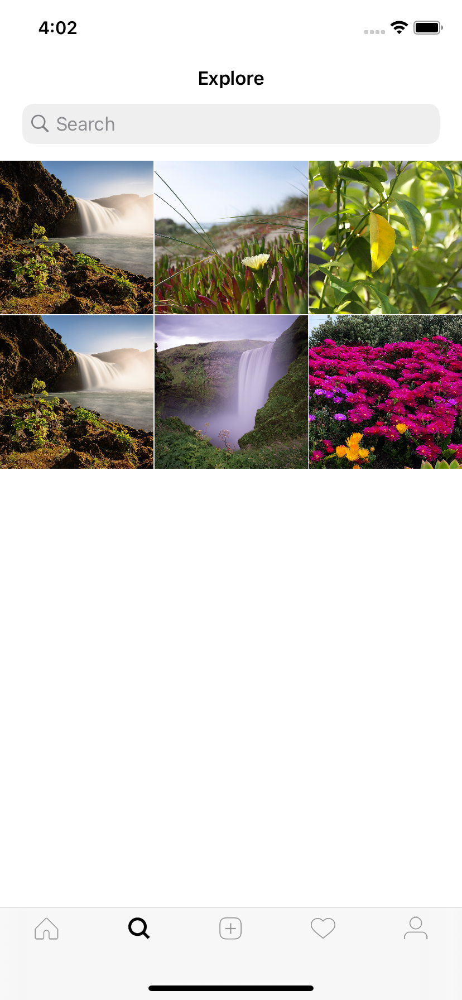
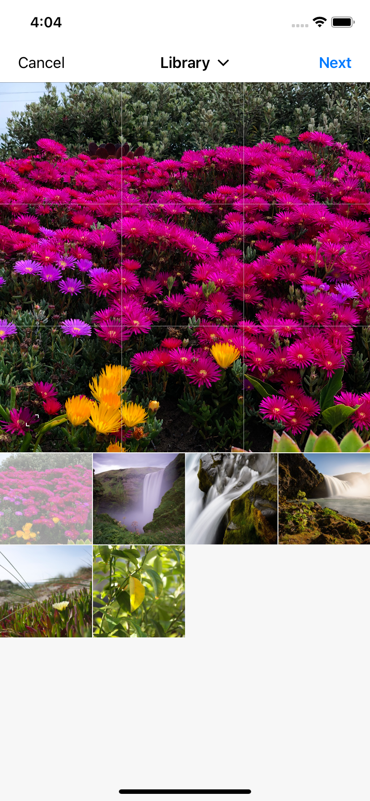
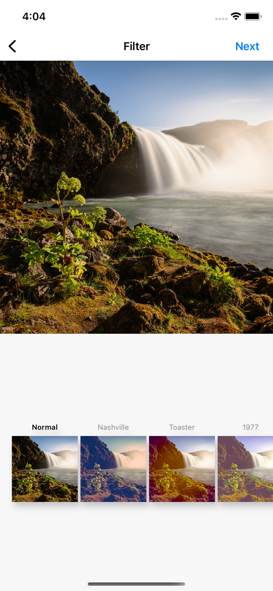

# Instagram Clone (Swift)

A clone social media of Instagram app build with Swift5, iOS 14 and Firestore withe modified MVVM Architecture

## Tools

- Swift
- iOS 14
- Cocoapods
- FireStore
- Implement Model View ViewModel (MVVM) architecture
- Custom extensions and functions and reusable code

## Functionality

- [x] Create users
- [x] Create a user profile
- [x] Authenticate users with Firebase
- [x] Search for users
- [x] Upload posts
- [x] Home feed with posts from followers
- [x] Like postsCreate users
- [x] Comment on posts
- [x] In app notifications for following, post likes and post comments
- [x] Follow/Unfollow users from profile
- [x] Follow/Unfollow user from notifications screen
- [x] Go to post or profile from notifications screen
- [x] Display timestamp on posts and notifications
- [x] Logging in and logging out 

## Screenshots

 